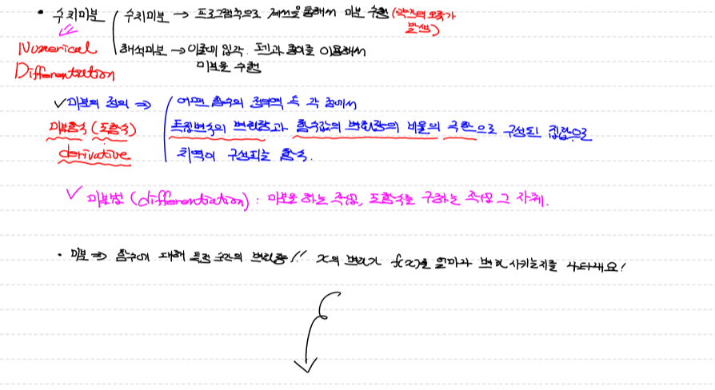
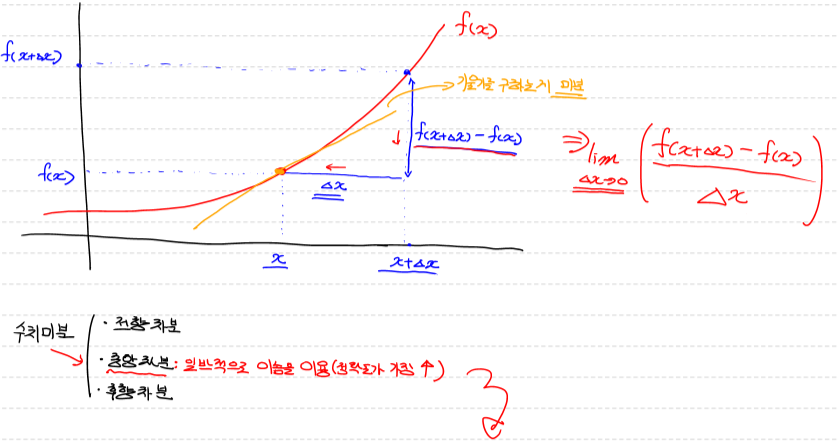
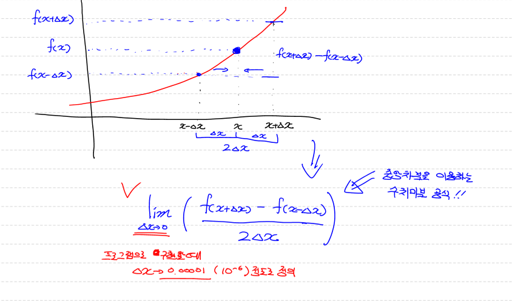
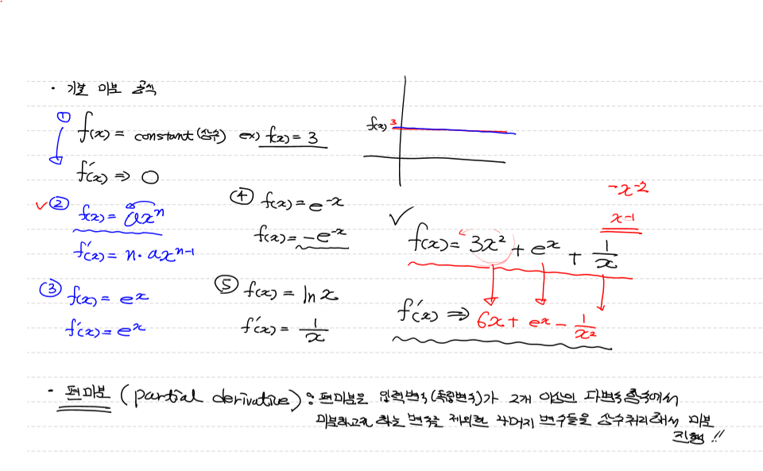
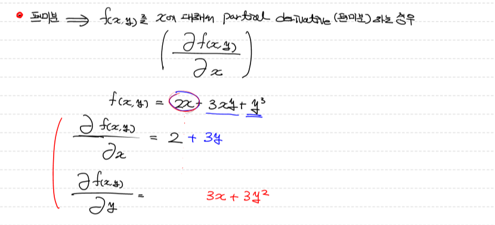
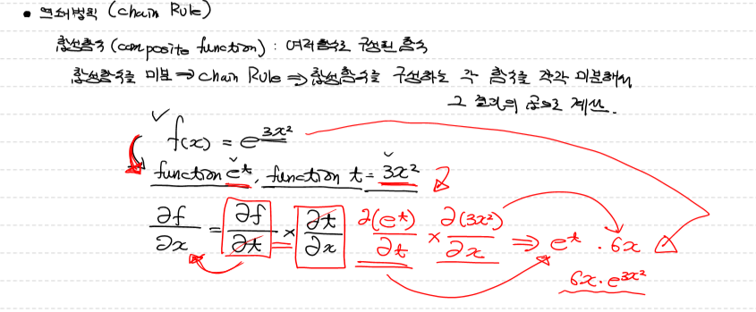
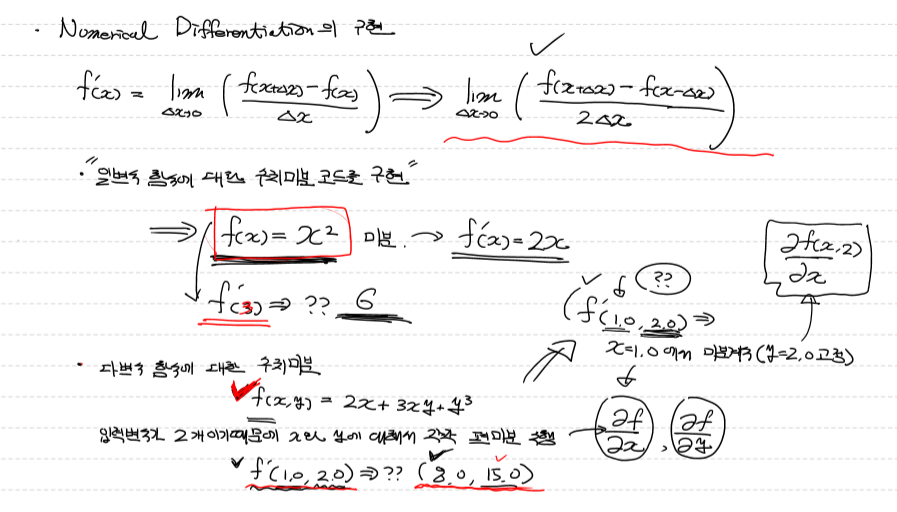
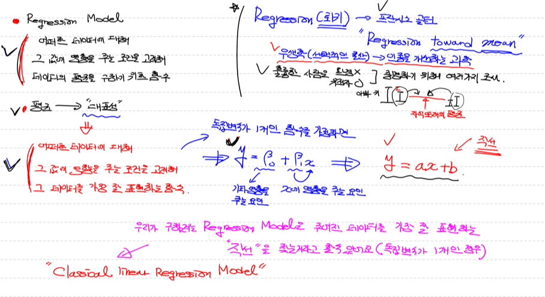
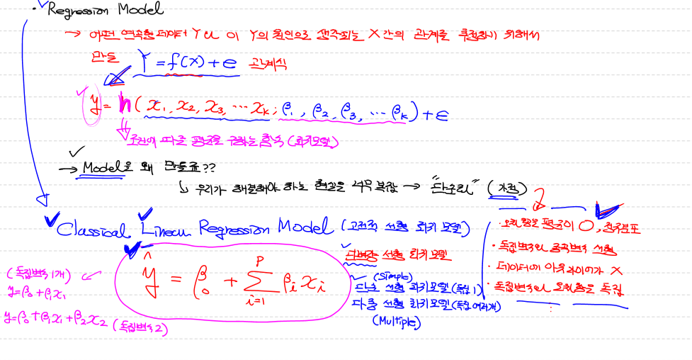

# Machine Learning

## 미분

> - 수치미분(Numerical Differentiation)
>   - 프로그램적으로 계산을 통해서 미분 수행(약간의 오차가 발생)
> - 해석미분 
>   - 이론에 입각. 펜과 종이를 이용해서 미분을 수행
> - 미분의 정의
>   - 어떤 함수의 정의역 속 각 점에서 독립변수의 변화량과 함수값의 변화량의 비율의 극한으로 구성된 집합으로 치역이 구성되는 함수
> - 미분법(differentiation)
>   - 미분을 하는 작업, 도함수를 구하는 작업 그 자체
> - 미분
>   - 함수에 대해 특정 순간의 변화량! 
>
> 
>
> 
>
> 
>
> 
>
> - 기본 미분 공식
>
>   - $$
>     f(x) = constant(상수)
>     $$
>     - $$
>       f'(x) = 0
>       $$
>
>       
>
>   - $$
>     f(x) =an^x
>     $$
>
>     - $$
>       f'(x) = n*ax^{n-1}
>       $$
>
>   - 
>
>   
>
>   - $$
>     f(x) = e^x
>     $$
>
>     - $$
>       f'(x) =e^x
>       $$
>
>   
>
>   - $$
>     f(x) = e^{-x}
>     $$
>
>     - $$
>       f'(x) = -e^{-x}
>       $$
>
>   
>
>   - $$
>     f(x) = lnx
>     $$
>
>     - $$
>       f'(x) =\frac{1}{x}
>       $$
>
>   
>
>   - $$
>     f(x) = 3x^2+e^x+\frac{1}{x}
>     $$
>
>     - $$
>       f'(x) = 6x+e^x-\frac{1}{x^2}
>       $$
>
> 
>
> 
>
> 
>
> 
>
> - 편미분 
>
>   - 편미분은 입력변수(독립변수)가 2개 이상인 다변수 함수에서 미분하고자 하는 변수를 제외한 나머지 변수들을 상수처리 
>
>   - f(x,y)를 x에 대해서 편미분하는 경우 (x에대해 편미분하기 떄문에 y를 상수로 취급)
>
>     - $$
>       \frac{αf(x,y)}{αx}
>       $$
>
>       $$
>       f(x,y) = 2x-3xy+y^2
>       $$
>
>       $$
>       \frac{αf(x,y)}{αx} = 2x+3y
>       $$
>
>       - f(x,y)를 y에 대해서 편미분하는 경우 (y에대해 편미분하기 떄문에 x를 상수로 취급)
>         $$
>         \frac{αf(x,y)}{αx} = 3x+3y^2
>         $$
>
> 

## 수치미분

> - 전향차분
> - 중앙차분
>   - 일반적으로 이용 (정확도가 가장 높음)
> - 후향차분


## 연쇄법칙 (Chain Rule)

> - 합성함수(composite function)
>
>   - 여러함수로 구성된 함수 
>
>   - 합성함수를 미분 => chain Rule => 합성함수를 구성하는 각 함수를 각각 미분해서 그 결과의 곱으로 계산
>
>   - $$
>     f(x) = e^{3x^2}
>     $$
>
>     - $$
>       function(e^t), function(t)=3x^2
>       $$
>
>       $$
>       \frac{αf}{αx} = \frac{αf}{αt}*\frac{αt}{αx}
>       $$
>
>       $$
>       \frac{α(e^t)}{αt}*\frac{α(3x^2)}{αx} = e^t*6x =6x*e^{3x^2}
>       $$
>
> 

## Numerical Differentiation의 구현

> - ```python
>   # 입력으로 들어오는 x에서 아주 미세하게 변화 할때 
>   # 함수 f가 얼마나 변화하는지에 대해 수치적으로 계산해기
>   
>   # 아래 함수는 인자를 2개 받음
>   # 한개는 미분하려는 함수, 특징점에서 미분값 구하기 위한 x값
>   
>   def numerical_derivative(f,x):
>       
>       # f : 미분하려는 함수 
>       # x : 미분값을 알고자하는 입력값.
>       #delta_x => 극한에 해당하는 값으로 아주 작은값을 이용.
>       #           1e-8이하로 지정하면 소수점 연산 오류발생
>       #           일반적으로 1e-5정도로 설정
>       
>       delta_x = 1e-5
>       
>       return (f(x+delta_x) - f(x-delta_x)) / (2*delta_x)
>   # 미분하려는 함수(단변수 함수)
>   def my_func(x): #f(x) =x**2
>       return x**2
>   result= numerical_derivative(my_func,3)
>   print('미분한 결과값은 : {}'.format(result))
>   
>   #############출력#############
>   
>   미분한 결과값은 : 6.000000000039306
>   ```
>
> - ```python
>   ### 일반적으로 다변수 함수의 수치미분 코드를 이용.
>   
>   # 입력변수가 2개 이상인 다변수 함수인 경우
>   # 입력변수는 서로 독립이기 때문에 수치미분 역시 변수의 개수만큼 개별적으로 진행해야 함!
>   
>   import numpy as np
>   
>   def numerical_derivative(f,x):
>       
>       # f : 미분하려고 하는 다변수 함수
>       # x : 모든 값을 포함하는 numpy array  ex) f'(1.0, 2.0) = (8.0, 15.0)
>       delta_x = 1e-4
>       derivative_x = np.zeros_like(x)    # [0 0]
>       
>       it = np.nditer(x, flags=['multi_index'])
>       
>       while not it.finished:
>           
>           idx = it.multi_index   # 현재의 iterator의 index를 추출 => tuple형태로 나옴
>           print('현재의 idx : {}'.format(idx))        
>           
>           tmp = x[idx]     # 현재 index의 값을 잠시 보존.
>                            # delta_x를 이용한 값으로 ndarray를 수정한 후 편미분을 계산
>                            # 함수값을 계산한 후 원상복구를 해 줘야 다음 독립변수에
>                            # 대한 편미분을 정상적으로 수행할 수 있음!
>           print('현재 temp : {}'.format(tmp))   
>           x[idx] = tmp + delta_x        
>           fx_plus_delta = f(x)    # f([1.00001, 2.0])   => f(x + delta_x)
>           
>   
>           x[idx] = tmp - delta_x
>           fx_minus_delta = f(x)    # f([0.99999, 2.0])   => f(x - delta_x)
>           
>           derivative_x[idx] = (fx_plus_delta - fx_minus_delta) / (2 * delta_x)
>           
>           x[idx] = tmp
>           
>           it.iternext()
>           
>       return derivative_x
>   
>   
>   # # 미분하려는 함수가 있어야 함! (단변수 함수)
>   # def my_func(x):
>       
>   #     return x ** 2     # f(x) = x^2
>   
>   # param = np.array([3.0])
>   
>   # 미분하려는 함수가 있어야 함! (다변수 함수)
>   def my_func(input_data):
>       
>       x = input_data[0]
>       y = input_data[1]
>       return 2*x + 3*x*y + np.power(y,3)     # f(x) = 2x + 3xy + y^3
>   
>   
>   param = np.array([1.0,2.0])
>   result = numerical_derivative(my_func,param)
>   print('미분한 결과는 : {}'.format(result))
>   
>   #############출력#############
>   
>   현재의 idx : (0,)
>   현재 temp : 1.0
>   현재의 idx : (1,)
>   현재 temp : 2.0
>   미분한 결과는 : [ 8.         15.00000001]
>   ```
>
> 
>
> 
>
> 


## Regression Model

> - 어떠한 데이터에 대해 그 값에 영향을 주는 조건을 고려해 데이터의 평균을 구하기 위한 함수
>
> - 평균 => 대표성
>
> - 대표성
>
>   - 어떠한 데이터에 대해 그 값에 영향을 주는 조건을 고려해 그 데이터를 가장 잘 표현하는 함수
>
>   - 독립변수가 1개인 함수를 가정하면 
>
>     - $$
>       y=β_0+β_{1x}
>       $$
>
>       β_0 => 기타영향을 주는 요인
>
>       β_1x => x에 영향을 주는 요인
>
> - Classical linear Regression Model
>   - 우리가 구하려는 Regression Model을 주어진 데이터를 가장 잘 표현하는 직선을 찾는거라고 할 수 있음 (독립변수가 1개인 경우)
> - Regression(회귀)  => 프란시스 골턴 "Regression toward mean"
>   - 우생학 (선택적인 확산) => 인종을 개선하는 과학
>     - 훌륭한 사람은 자라온 환경이 아니라 유전자에 의해 영향을 받는다 라는것을 증명하기 위해 여러가지 조사 
>
> 
>
> - 어떤 연속형 데이터 Y와 이 Y의 원인으로 생각되는 X간의 관계를 추정하기 위해서 만든 Y = f(x)+e 관계식
>
>   - $$
>     y=h(x_1,x_2,x_3,x_4...x_k,β_1,β_2,β_3,β_4....β_k)+e
>     $$
>
>     - h => 조건에 따른 평균을 구하는 함수(회귀모델)
>
> - Model을 만드는 이유
>
>   - 우리가 해결해야 하는 현실은 너무 복잡 => 단순화 (가정)
>
> 