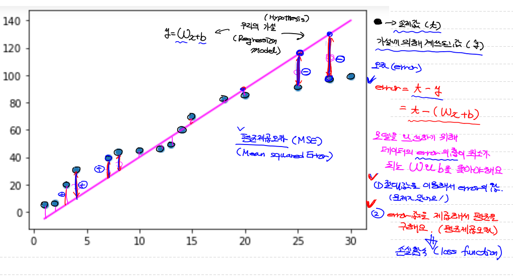
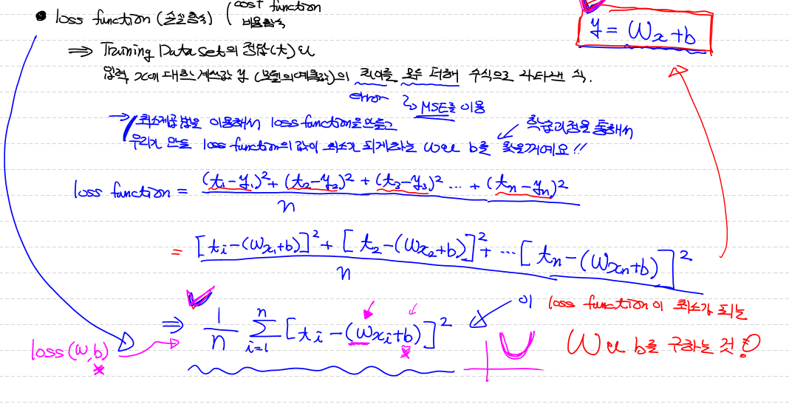
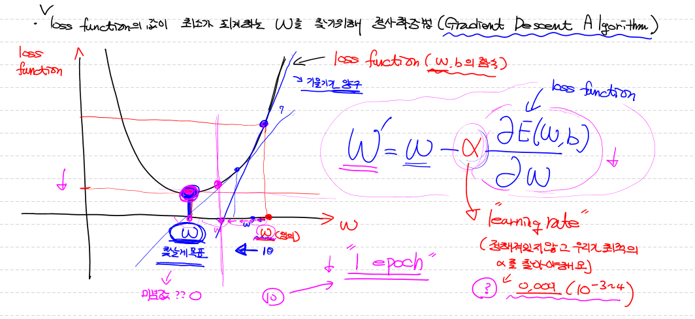
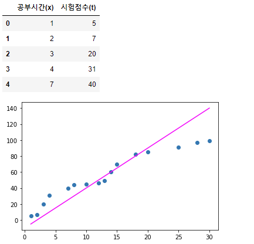
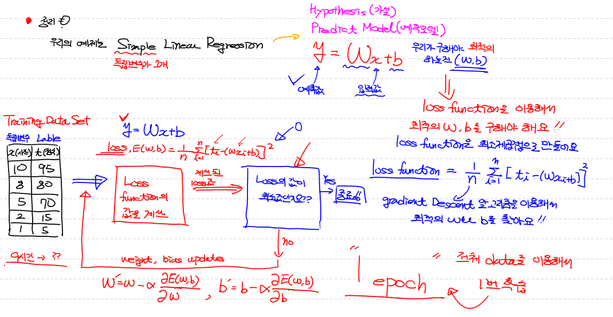
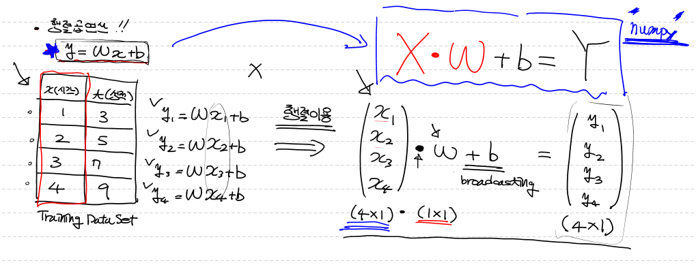
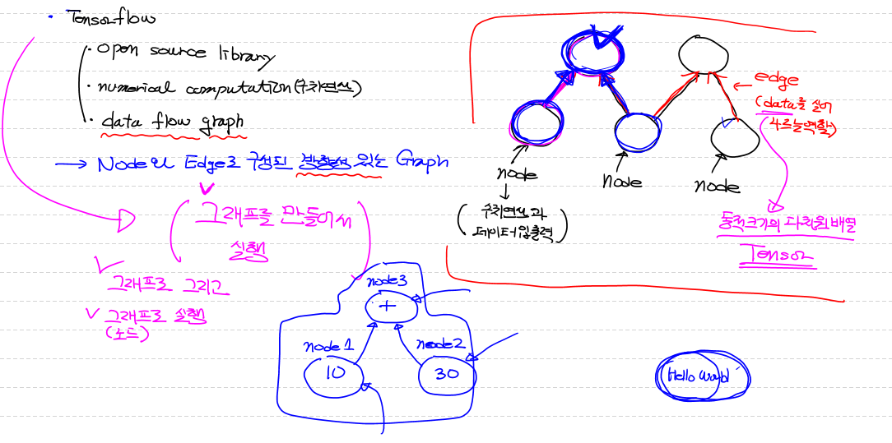

# Machine Learning

## Machine Learning

> - 지도학습 
>
>   - 학습 데이터셋(Training Data Set) 안에  이력값(feature) + label(정답) => 학습 진행 => Predict model(예측모델) => 미지의 데이터에 대한 예측값을 알아냄 
>
>   - 예측 모델을 이용해 어떤것을 예측하느냐에 따라
>
>     - Regression(회귀) : Training Data Set을 이용해 학습하고 나온 Predict Model 이  연속적인 값을 예측
>     - Classification: predict Model 어떤 부류에 속하는지를 예측
>
>   - 학습 (learning)
>
>     - Classical linear Regression Model(고전적 선형 회귀 모델)
>
>     -  
>       $$
>       y=β_0+\sum_{i=1}^pβ_ix_i
>       $$
>
>       - $$
>         y=β_0+β_1x_1
>         $$
>
>         - $$
>           y=ax+b
>           $$
>
>           - $$
>             y=ωx+b
>             $$
>
>             ω = weight(가중치) , b = bias
>
>     
>
>     
>
>   - loss function (손실함수)(비용함수 cost function)
>
>     - Training Data Set의 정답(t)와 입력 x에 대한 계산값 y(모델의 예측값)의 차이(error)를 모두 더해(MSE를 이용) 수식으로 나타낸식
>
>       - 최소 제곱법을 이용해서 우리가 만들 loss function의 값이 최소가 되게하는 ω와 b를 찾을것임
>
>       - $$
>         loss function = (t_1-y_1)^2+(t_2-y_2)^2+(t_3-y_3)^2+...+(t_n-y_n)^2
>         $$
>
>         - $$
>           {[t_i-(ω_{x_1}+b)]^2+[t_2-(ω_{x_2}+b)]^2+...+[t_n-(ω_{x_n}+b)]^2 \over n}
>           $$
>
>           - $$
>             {1 \over n}\sum_{i=1}^n[t_i-(ω_{x_i}+b)]^2
>             $$
>
>             - loss function이 최소가 되는 ω와 b를 구하는것 
>
>     
>
>     
>
>     - ```python
>       import numpy as np
>       import pandas as pd
>       import matplotlib.pyplot as plt
>       
>       my_dict = {
>           '공부시간(x)' : [1,2,3,4,7,8,10,12,13,14,15,18,20,25,28,30],
>           '시험점수(t)' : [5,7,20,31,40,44,45,46,49,60,70,82,85,91,97,99]
>       }
>       
>       df = pd.DataFrame(my_dict)
>       
>       display(df.head())
>       
>       plt.scatter(df['공부시간(x)'],df['시험점수(t)'])
>       
>       # 직선을 그림!
>       # plt.plot(df['공부시간(x)'],df['공부시간(x)']*2 + 3, color='r')
>       # plt.plot(df['공부시간(x)'],df['공부시간(x)']*5 - 7, color='g')
>       # plt.plot(df['공부시간(x)'],df['공부시간(x)']*1 + 8, color='b')
>       plt.plot(df['공부시간(x)'],df['공부시간(x)']*5 - 10, color='magenta')
>       
>       plt.show()
>       ```
>
>       - 출력
>       - 
>
>     
>
>     
>
> - 정리
>
>   - 우리의 예제는 Simple(독립변수가 1개) Linear Regression
>
>     - Hypothesis(가설)
>
>     - Predict Model(예측모델)
>
>     - $$
>       y=ω_x+b
>       $$
>
>       - y : 예측값,  ωx: 입력값 , 우리가 구해야 하는건 (ω,b)
>
>       - loss function을 이용해서 최적의 ω,b를 구해야함
>
>       - loss function은 최소 제곱법으로 만듬
>
>       - $$
>         loss function = {1 \over n}\sum_{i=1}^n[t_i-(ω_{x_i}+b)]^2
>         $$
>
>         - gradient descent 알고리즘을 이용하여 최적의 ω,b를 찾음 
>
>     

## 독립변수가 1개인 단순선형회귀(Simple Linear Regression)모델 코드구현

> - ```python
>   # 독립변수가 1개인 단순선형회귀(Simple Linear Regression)모델에 대해서 알아보는중!
>   # 이론적으로 이해한 내용을 코드로 표현!
>   
>   # 1. Training Data Set 준비 : ndarray를 이용해서 데이터셋을 사용!
>   # 2. Linear Regression Model을 정의 : 
>   #    - Weight와 bias를 정의하고 이를 이용해서 Hypothesis(Model)을 정의!
>   # 3. Loss function 정의 : 손실함수(Loss function)을 코드로 표현
>   # 4. learning rate를 정의 : 일반적으로 customizing해야 하는 값으로
>   #                           1e-3정도로 설정해서 사용.
>   # 5. 학습을 진행 : 반복적으로 편미분을 이용해서 W와 b의 값을 update처리
>   #
>   
>   # Tensorflow를 이용해서 구현!!
>   # python코드로는 다음에 구현!
>   
>   %reset
>   
>   import numpy as np
>   
>   # 0. 수치미분 코드
>   def numerical_derivative(f,x):
>       
>       # f : 미분하려고 하는 다변수 함수
>       # x : 모든 값을 포함하는 numpy array  ex) f'(1.0, 2.0) = (8.0, 15.0)
>       delta_x = 1e-4
>       derivative_x = np.zeros_like(x)    # [0 0]
>       
>       it = np.nditer(x, flags=['multi_index'])
>       
>       while not it.finished:
>           
>           idx = it.multi_index   # 현재의 iterator의 index를 추출 => tuple형태로 나와요
>           print('현재의 idx : {}'.format(idx))        
>           
>           tmp = x[idx]     # 현재 index의 값을 잠시 보존.
>                            # delta_x를 이용한 값으로 ndarray를 수정한 후 편미분을 계산
>                            # 함수값을 계산한 후 원상복구를 해 줘야 다음 독립변수에
>                            # 대한 편미분을 정상적으로 수행할 수 있어요!
>           print('현재 temp : {}'.format(tmp))   
>           x[idx] = tmp + delta_x        
>           fx_plus_delta = f(x)    # f([1.00001, 2.0])   => f(x + delta_x)
>           
>   
>           x[idx] = tmp - delta_x
>           fx_minus_delta = f(x)    # f([0.99999, 2.0])   => f(x - delta_x)
>           
>           derivative_x[idx] = (fx_plus_delta - fx_minus_delta) / (2 * delta_x)
>           
>           x[idx] = tmp
>           
>           it.iternext()
>           
>       return derivative_x
>   
>   
>   # 1. Training Data Set
>   x_data = np.array([1,2,3,4,5]).reshape(5,1)
>   t_data = np.array([3,5,7,9,11]).reshape(5,1)
>   
>   # 2-1. Weight & bias 정의
>   W = np.random.rand(1,1)
>   b = np.random.rand(1)
>   
>   # 2-2. 학습종료 후 임의의 데이터에 대해서 예측값을 알아오는 함수
>   def predict(x):
>       
>       y = np.dot(x,W) + b   # Hypothesis
>       
>       return y
>   
>   # 3. Loss function 정의
>   #    ???
>   def loss_func():
>       pass
>   ```
>
>   


## Tensorflow

> - Tensorflow는 Google이 만든 Deep Library
> - Tensorflow는 1.x버전과 2.x버전으로 나뉘어짐
> - 2019년 10월 Tensorflow 2.x버전이 정식으로 release
> - 1.x버전은 low level의 코딩이 필요!
> - 2.x버전은 상위 API(Keras)가 기본으로 포함. => 구현이 쉬움!


## Tensorflow를 이용해서 배운 이론을 실제로 구현해 보기

> - ```python
>   import tensorflow as tf
>   print(tf.__version__)
>   
>   node1 = tf.constant('Hello World')
>   
>   # 그래프를 실행하려면 1.x버전에서는 session이 필요
>   # session은 그래프안의 특정 노드를 실행시킬 수 있음!
>   sess = tf.Session()
>   
>   print(sess.run(node1).decode())
>   
>   # print(node1)  # Tensor("Const:0", shape=(), dtype=string)
>   
>   ##############출력#################
>   
>   1.15.0
>   Hello World
>   ```
>
> - ```python
>   import tensorflow as tf
>   
>   node1 = tf.constant(10, dtype=tf.float32)
>   node2 = tf.constant(30, dtype=tf.float32)
>   
>   node3 = node1 + node2
>   
>   # session은 tensorflow 그래프를 실행시키기 위해서 필요!
>   # 1.x버전에서만 사용되요. 2.x버전에서는 삭제
>   sess = tf.Session()
>   
>   print(sess.run([node3, node1]))
>   
>   ##############출력#################
>   
>   [40.0, 10.0]
>   ```
>
> 


