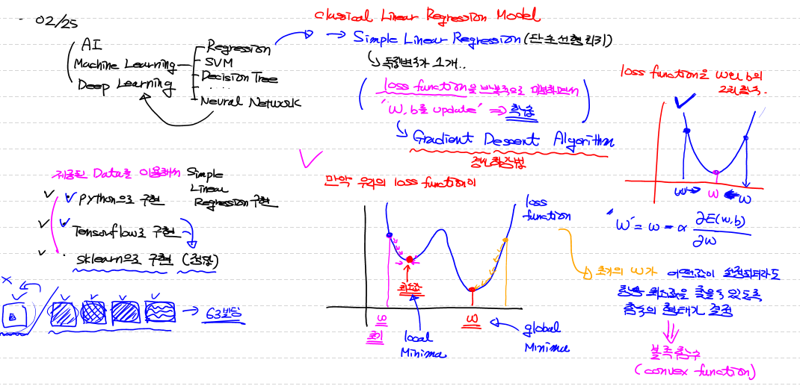
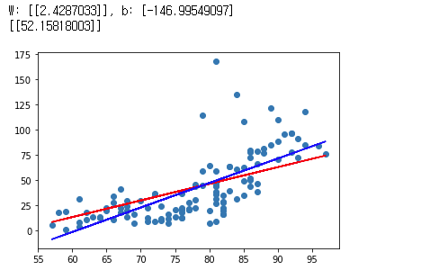
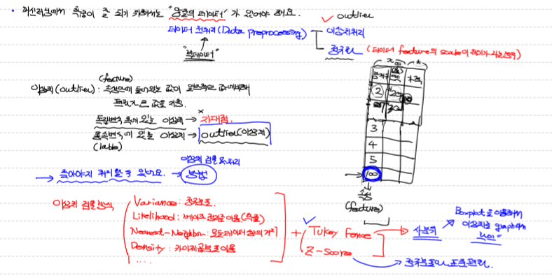
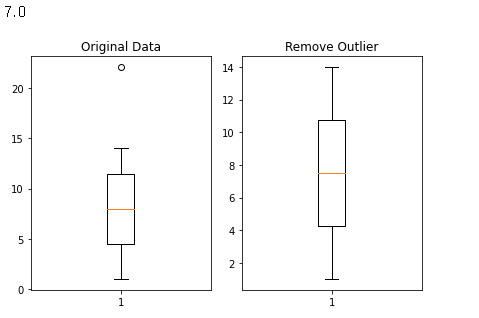
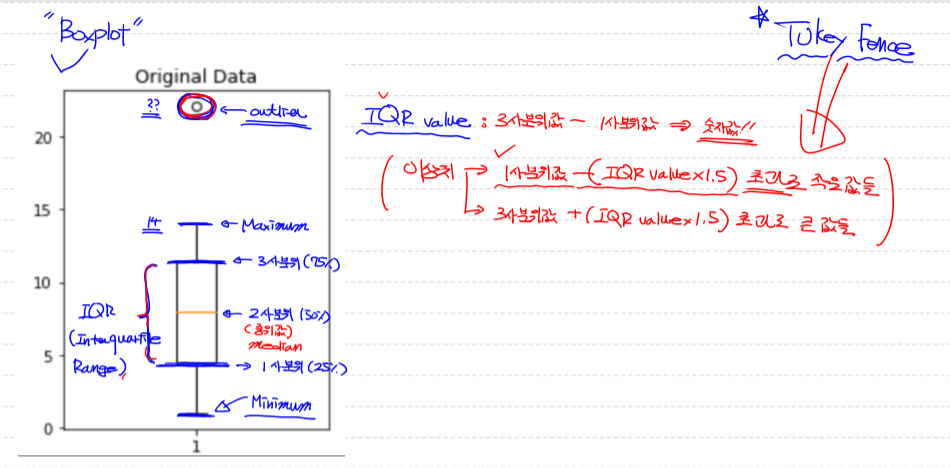
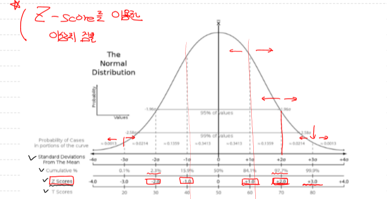

# Machine Learning

## 지난 내용 정리

> - AI
>
> - Machine Learning
>
>   - Regression
>
>     - Classical Linear Regression Model
>
>       - Simple Linear Regression
>
>         - 독립변수가 1개
>
>         - Loss function을 반복적으로 미분하면서 W,b를 Update => 학습 
>
>           => Gradient Descent Algorithem
>
>   - SVM
>
>   - Decision Tree
>
>   - Neural Network
>
>   - .........
>
> - Deep Learning
>
> 

## Ozone data를 이용해서 Simple Linear Regression을 구현

> ```python
> # tensorflow를 이용해서 구현
> 
> import numpy as np
> import pandas as pd
> import tensorflow as tf
> 
> # 1. trainig data set
> df = pd.read_csv('./ozone.csv')
> # display(df)
> trainig_data = df[['Temp','Ozone']]
> # display(trainig_data)   # (153, 2)
> # 결측치가 존재!(NaN이 존재)
> # 결측치를 해결해야 함! => 가장 쉬운방법 -> 삭제!
> #                         => 다른방법 -> 평균, 최대, 최소 
> #                         => 조금더 나은방법 => ML을 이용해 예측한 값을 이용
> # 삭제할꺼예요!!
> trainig_data = trainig_data.dropna(how='any')
> display(trainig_data.shape) # (116, 2)  너무 많이 삭제되었음..좋지 않음!
> 
> # 이상치를 처리해야 함!
> # 이상치가 존재하면 학습의 결과가 크게 왜곡될 수 있음!
> # 일단은 이상치 처리를 하지않고 실행!
> 
> x_data = trainig_data['Temp'].values.reshape(-1,1)
> # print(x_data)
> t_data = trainig_data['Ozone'].values.reshape(-1,1)
> 
> # 2. placeholder
> X = tf.placeholder(shape=[None,1], dtype=tf.float32)
> T = tf.placeholder(shape=[None,1], dtype=tf.float32)
> 
> # 3. Weight & bias 
> W = tf.Variable(tf.random.normal([1,1]), name='weight')
> b = tf.Variable(tf.random.normal([1]), name='bias')
> 
> # 4. Hypothesis (predict model)
> H = tf.matmul(X,W) + b
> 
> # 5. loss function
> loss = tf.reduce_mean(tf.square(H - T))
> 
> # 6. train
> train = tf.train.GradientDescentOptimizer(learning_rate=1e-4).minimize(loss)
> 
> # 7. session, 초기화
> sess = tf.Session()
> sess.run(tf.global_variables_initializer())
> 
> # 8. 학습
> for step in range(300000):
>     
>     _, W_val, b_val, loss_val = sess.run([train, W, b, loss], 
>                                          feed_dict={X: x_data, T: t_data})
>     if step % 30000 == 0:
>         print('W : {}, b : {}, loss : {}'.format(W_val, b_val, loss_val))
>         
> #############출력##############
> 
> (116, 2)
> W : [[0.5777743]], b : [-0.4417297], loss : 865.7070922851562
> W : [[0.7284522]], b : [-12.648489], loss : 814.3255615234375
> W : [[0.87006927]], b : [-23.8385], loss : 772.553466796875
> W : [[0.9998807]], b : [-34.095676], loss : 737.4526977539062
> W : [[1.1188967]], b : [-43.49985], loss : 707.95166015625
> W : [[1.2279793]], b : [-52.11911], loss : 683.1646728515625
> W : [[1.3279867]], b : [-60.021294], loss : 662.3325805664062
> W : [[1.4195956]], b : [-67.25986], loss : 644.8387451171875
> W : [[1.503619]], b : [-73.89905], loss : 630.129150390625
> W : [[1.5807611]], b : [-79.9945], loss : 617.7493896484375
> ```
>
> ```python
> import matplotlib.pyplot as plt
> 
> plt.scatter(x_data, t_data)
> plt.plot(x_data, x_data*W_val.ravel() + b_val, color='r')
> plt.show()
> 
> # prediction
> result = sess.run(H, feed_dict={X: [[82]]})
> print(result)   # [[49.838455]]  
> ```
>
> -  출력
>
>   


## scikit-learn을 이용해서 해당 data를 학습시키고 predict

> ```python
> import numpy as np
> import pandas as pd
> import matplotlib.pyplot as plt
> from sklearn import linear_model
> 
> # 1. trainig data set
> df = pd.read_csv('./ozone.csv')
> trainig_data = df[['Temp','Ozone']]
> trainig_data = trainig_data.dropna(how='any')
> x_data = trainig_data['Temp'].values.reshape(-1,1)
> t_data = trainig_data['Ozone'].values.reshape(-1,1)
> 
> # 2. model 생성
> model = linear_model.LinearRegression()
> 
> # 3. model을 학습
> model.fit(x_data,t_data)
> 
> # 4. Weight, bias 출력
> # tensorflow 구현 : W : [[1.5807611]], b : [-79.9945]
> # sklearn 구현 : W: [[2.4287033]], b: [-146.99549097]
> print('W: {}, b: {}'.format(model.coef_, model.intercept_))
> 
> # predict
> # tensorflow : [[49.838455]]
> # sklearn : [[52.15818003]]
> print(model.predict([[82]]))
> 
> plt.scatter(x_data, t_data)
> plt.plot(x_data, x_data*W_val.ravel() + b_val, color='r')
> plt.plot(x_data, x_data*model.coef_.ravel() + model.intercept_, color='b')
> plt.show()
> 
> ```
>
> - 출력 
>
>   


## 이상치

> - 이상치(outlier) 
>   - 속성안에 들어있는 값이 일반적인 값에비해 편차가 큰 값을 지칭
>   - 독립변수에 있는 이상치  => 지대점
>   - 종속변수(label)에 있는 이상치  => outlier(이상치)
> - 이상치 검출 방식
>   - Variance : 정규분포
>   - Likelihood: 베이즈 정리를 이용(확률)
>   - Nearest-Neighbor: 모듈데이터상의 거리
>   - Density : 카이제곱분포이용
>
> 

## Boxplot을 이용하여 이상치를 확인

> ```python
> # Boxplot을 이용하여 이상치를 확인해 보아요!
> import numpy as np
> import matplotlib.pyplot as plt
> 
> data = np.array([1,2,3,4,5,6,7,8,9,10,11,12,13,14,22.1])
> 
> fig = plt.figure()   # 새로운 figure를 생성
> fig_1 = fig.add_subplot(1,2,1)
> fig_2 = fig.add_subplot(1,2,2)
> 
> fig_1.set_title('Original Data')
> fig_1.boxplot(data)
> 
> # numpy를 이용해서 사분위수를 구해보아요! percentile()
> # print(np.median(data))         # 중위값(2사분위) => 8.0
> # print(np.percentile(data,25))  # 1사분위 => 4.5
> # print(np.percentile(data,50))  # 2사분위 => 8.0
> # print(np.percentile(data,75))  # 3사분위 => 11.5
> 
> # IQR value
> iqr_value = np.percentile(data,75) - np.percentile(data,25)
> print(iqr_value)  # 7.0
> 
> upper_fense = np.percentile(data,75) + (iqr_value * 1.5)
> lower_fense = np.percentile(data,25) - (iqr_value * 1.5)
> 
> # print(upper_fense)  # 22.0
> # print(lower_fense)  # -6.0
> 
> ## 이상치를 출력해보아요!!
> ## boolean indexing을 이용해서 이상치를 출력해보아요!
> # print(data[(data > upper_fense) | (data < lower_fense)])  # [22.1]
> 
> result = data[(data <= upper_fense) & (data >= lower_fense)]
> # print(result)
> 
> fig_2.set_title('Remove Outlier')
> fig_2.boxplot(result)
> 
> fig.tight_layout()
> plt.show()
> ```
>
> - 출력
>
>   
>
> 


## 이상치를 판별하는 두번째 방법

> ```python
> # Z-Score를 이용해서 처리하는 방식 => 정규분포와 표준편차를 이용해서
> # 이상치를 검출하는 방식
> 
> import numpy as np
> from scipy import stats
> 
> zscore_threshold = 1.8 # (2.0이 optimal value) => 상위 95% 이상, 하위 95% 이하인 값
> 
> data = np.array([1,2,3,4,5,6,7,8,9,10,11,12,13,14,22.1])
> 
> # outlier 출력
> outlier = data[np.abs(stats.zscore(data)) > zscore_threshold]
> 
> # 이상치를 제거한 데이터
> data[np.isin(data,outlier, invert=True)]
> 
> ############출력#####################
> 
> array([ 1.,  2.,  3.,  4.,  5.,  6.,  7.,  8.,  9., 10., 11., 12., 13.,
>     14.])
> ```
>
> 

