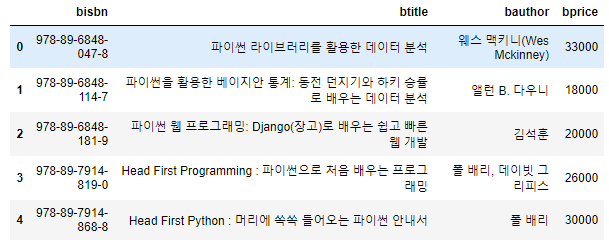
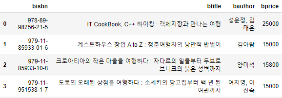

# DataFrame을 만드는 방법

> *  python의 dict(dictionary)를 직접 작성해서 DataFrame을 생성
> * CSV파일을 이용해서 DataFrame을 생성하는 방법
> * Database안에 있는 데이터를 이용해서 DataFrame을 생성
>   * Database를 설정! => mysql을 사용!
>   * 우리가 Database라고 부르는것들은 실제로 DBMS라고 불러야 함!
>   * 오라클사의 Oracle
>   * IBM의 DB2, MS의 SQL Server
>   * MySQL, 마리아디비, Postgres, infomix, cybase, ...
>   * Database : 논리적인 데이터들의 집합체
>   * DBMS는 이런 데이터의 집합체인 Database를 관리하는 프로그램들의 집합

## MySQL에서 data를 읽어와서 DataFrame으로 만들기!

> * python프로그램이 MySQL DBMS에 접속해야 함!
>
> * 필요한 module을 설치!!
>
> * 우리는 pymysql이라는 모듈을 이용!
>
> * ```python
>   import pymysql
>   import numpy as np
>   import pandas as pd
>   
>   # 데이터베이스 접속
>   # 만약 연결에 성공하면 연결객체가 생성됨!!
>   
>   conn = pymysql.connect(host='localhost',
>                          user='data',
>                          password='data',
>                          db='library',
>                          charset='utf8')
>   
>   # 접속이 성공했으면 데이터를 가져오기!
>   # 책 제목에 특정 키워드가 들어가 있는 책들을 검색해서 해당 책의
>   # isbn, 제목, 저자, 가격 정보를 가져기!
>   keyword = '파이썬'
>   # database에서 데이터를 가져오려면 database에서 사용되어지는 언어로
>   # 질의(query)를 전달해야 함! => SQL(데이터베이스용 프로그래밍 언어)
>   sql = "SELECT bisbn, btitle, bauthor, bprice FROM book WHERE btitle LIKE '%{}%'".format(keyword)
>   
>   # python의 예외처리를 이용하는게 좋음!
>   # 코드를 작성하는 시점에서는 잘 될거같음! 실행할때 만약
>   # 데이터베이스가 중지되어 있으면 당연히 오류
>   try:
>       df = pd.read_sql(sql, con=conn)
>       display(df)
>   except Exception as err:    
>       print(err)
>   finally:
>       conn.close()
>       
>   ```
>
>   * 출력 


## JSON 형태로 데이터 프레임 저장 

> * ```python
>   conn = pymysql.connect(host='localhost',
>                          user='data',
>                          password='data',
>                          db='library',
>                          charset='utf8')
>   
>   keyword = '여행'
>   sql = "SELECT bisbn, btitle, bauthor, bprice FROM book WHERE btitle LIKE '%{}%'".format(keyword)
>   try:
>       df = pd.read_sql(sql, con=conn)
>   except Exception as err:    
>       print(err)
>   finally:
>       conn.close()
>       
>   # DataFrame을 JSON형식으로 파일에 저장
>   # 몇가지 형식으로 데이터를 저장할 수 있음!
>   
>   # python으로 파일처리를 하려면
>   # 1. 파일 오픈 ( file1 = open('test.txt') )
>   # 2. 파일 처리 ( file1.readline() )
>   # 3. 파일 close ( file1.close() )
>   # 원래 이렇게 처리해야 하는데 코드 방식을 좀 바꾸면 조금 더 효율적으로
>   # 처리할 수 있음!
>   # 예전 파일 처리
>   
>   # column명을 json의 key값으로 이용해서 JSON을 생성
>   with open('./data/books_orient_column.json', 'w', encoding='utf-8') as file1:
>       df.to_json(file1, force_ascii=False, orient='columns')
>   
>   with open('./data/books_orient_records.json', 'w', encoding='utf-8') as file2:
>       df.to_json(file2, force_ascii=False, orient='records')
>   ```
>
> * 왜 JSON으로 바꾸나??
>
> * 데이터 표현방식은 크게 3가지 => CSV, XML, JSON
>
> * 내가 가진 DataFrame의 내용을 다른 컴퓨터나 다른 사람에게 전달하기 위해서는 이런 표준형태의 데이터 표현방식으로 변환시켜서 전달해야 함!

## JSON 파일을 읽어서 pandas의 DataFrame으로 만들기!

> * ```python
>   import numpy as np   # 외장 모듈이기때문에 설치작업이 필요
>   import pandas as pd  # 외장 모듈이기때문에 설치작업이 필요
>   import json   # json은 내장 모듈
>   
>   with open('./data/books_orient_records.json', 'r', encoding='utf-8') as file1:
>       dict_book = json.load(file1)  # json을 읽어서 python의 dict로 변환
>       
>   print(dict_book)    
>   print(type(dict_book))   
>   
>   # DataFrame은 일반 dict를 이용해서 만들 수 있음!
>   df = pd.DataFrame(dict_book)
>   display(df)
>   
>   ###################출력########################
>   
>   [{'bisbn': '978-89-98756-21-5', 'btitle': 'IT CookBook, C++ 하이킹 : 객체지향과 만나는 여행', 'bauthor': '성윤정, 김태은', 'bprice': 25000}, {'bisbn': '979-11-85933-01-6', 'btitle': '게스트하우스 창업 A to Z : 청춘여행자의 낭만적 밥벌이', 'bauthor': '김아람', 'bprice': 15000}, {'bisbn': '979-11-85933-10-8', 'btitle': '크로아티아의 작은 마을을 여행하다 : 자다르의 일몰부터 두브로브니크의 붉은 성벽까지', 'bauthor': '양미석', 'bprice': 15800}, {'bisbn': '979-11-951538-1-7', 'btitle': '도쿄의 오래된 상점을 여행하다 : 소세키의 당고집부터 백 년 된 여관까지', 'bauthor': '여지영, 이진숙', 'bprice': 15000}]
>   <class 'list'>
>   ```
>
>   * 출력 


## DataFrame을 만드는 또 다른 방법

> * Open API를 이용해서 그 결과를 가지고 DataFrame으로 만들기!
>   * Open API (공개적으로 누구나 사용할 수 있는 웹 프로그램)
> * 영화진흥위원회에서 제공하는 일일 박스오피스 순위에 대한 Open API를 이용해 보기!
> * 요청URL 
>   *  http://www.kobis.or.kr/kobisopenapi/webservice/rest/boxoffice/searchDailyBoxOfficeList.json
> * 요청변수
>   * key    xxxxxxxxxxxxxxxxxxxxxxxxxxx
>   * targetDt    20210113
> * GET방식으로 호출!!!!!
>   * Query String을 이용해서 호출
>   * Query String은 요청인자를 전달하기 위한 특별한 형식
>   * ?key=xxxxxxxxxxxxxxxxxxxxxxxxxxx
>   * http://www.kobis.or.kr/kobisopenapi/webservice/rest/boxoffice/searchDailyBoxOfficeList.json?key=xxxxxxxxxxxxxxxxxxxxxxxxxxx


