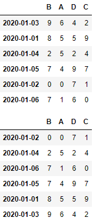
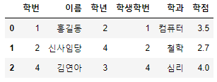

# DataFrame이 지원하는 함수


## 기댓값

> * 어떤 확률을 가진 사건을 무한히 반복했을때 얻을 수 있는 값의 평균으로 기대할 수 있는 값.
>
> * ```python
>   import numpy as np
>   result = np.random.randint(1,7,(100000,))
>   print(result.mean())
>   
>   #############출력#################
>   
>   3.49796
>   ```


## 편차

> * 확률변수 X와 평균값의 차이
> * 데이터의 흩어짐 정도를 나타낼 수 있는 값.
> * 편차의 합계는 결국 0이기 때문에 데이터의 흩어진 정도를 수치화 하기가 힘듬!
>
> * 분산(variance) 
>
>   * 편차의 제곱의 평균
>
> * 표준편차
>
>   * 분산의 제곱근
>
> * ```python
>   arr = np.array([4,6,1,3,8,8], dtype=np.int32)
>   print(arr)
>   print(arr.sum())
>   print(arr.mean())
>   print(arr.var())
>   print(arr.std())
>   
>   #############출력#################
>   
>   3.49796
>   [4 6 1 3 8 8]
>   30
>   5.0
>   6.666666666666667
>   2.581988897471611
>   ```


## 공분산

> * DataFrame으로 공분산을 계산할 수 있음!
>
> * 공분산(covariance) 
>
>   * 두개의 확률변수의 관계를 보여주는 값.
>   * 두 확률변수 편차의 곱에 대한 평균으로 계산.
>
> * ```python
>   import numpy as np
>   import pandas as pd
>   import pandas_datareader.data as pdr
>   from datetime import datetime
>   
>   start = datetime(2019,1,1)  # 2019-01-01 날짜 객체 생성
>   end = datetime(2019,12,31)  # 2019-12-31 날짜 객체 생성
>   
>   # YAHOO에서 제공하는 KOSPI 지수
>   df_KOSPI = pdr.DataReader('^KS11','yahoo',start,end)
>   # display(df_KOSPI['Close'].values)
>   # YAHOO에서 제공하는 삼성전자 지수
>   df_SE = pdr.DataReader('005930.KS','yahoo',start,end)
>   # display(df_SE['Close'].values)
>   
>   # numpy가 제공하는 함수를 이용해서 공분산을 계산
>   print(np.cov(df_KOSPI['Close'].values,df_SE['Close'].values))
>   # 0행 0열 : KOSPI의 공분산( KOSPI & KOSPI )
>   # 0행 1열 : KOSPI와 삼성전자의 공분산
>   # 1행 0열 : 삼성전자와 KOSPI의 공분산
>   # 1행 1열 : 삼성전자의 공분산( 삼성전자 & 삼성전자 )
>   # sum((xi - x평균)(yi-y평균)) / n-1
>   
>   #############출력#################
>   
>   [[6.28958682e+03 9.46863621e+04]
>    [9.46863621e+04 1.41592089e+07]]
>   ```


## 상관관계(correlation)  

> * 두 대상이 서로 연관성이 있다고 추측되는 관계
>
>   * ex) 성적과 자존감
>   * ex) 온라인 게임과 폭력성
>
> * 상관계수(correlation coefficient)
>
>   * -1과 1사이의 실수.(피어슨 상관계수)
>   * 하나의 변수가 변할 때 다른 변수가 변화하는 정도
>   * 양수값이 나오면 정적상관관계, 음수가 나오면 부적상관관계
>
> * 상관관계를 얘기할때 조심해야 할 점
>
>   * 인과관계를 설명할 수 없음!
>
> * ```python
>   import numpy as np
>   import pandas as pd
>   import pandas_datareader.data as pdr
>   from datetime import datetime
>   
>   start = datetime(2018,1,1)  # 2018-01-01 날짜 객체 생성
>   end = datetime(2018,12,31)  # 2018-12-31 날짜 객체 생성
>   
>   # YAHOO에서 제공하는 종목 지수
>   df_KOSPI = pdr.DataReader('^KS11','yahoo',start,end)  # KOSPI
>   df_SE = pdr.DataReader('005930.KS','yahoo',start,end) # 삼성전자
>   df_PUSAN = pdr.DataReader('011390.KS','yahoo',start,end) # 부산산업(남북경협)
>   df_LIG = pdr.DataReader('079550.KS','yahoo',start,end) # LIG넥스원(방위)
>   
>   my_dict = {
>       'KOSPI' : df_KOSPI['Close'],
>       '삼성전자' : df_SE['Close'],
>       '부산산업' : df_PUSAN['Close'],
>       'LIG넥스원' : df_LIG['Close']
>   }
>   
>   df = pd.DataFrame(my_dict)
>   display(df)
>   
>   display(df.corr())  # DataFrame이 가지고 있는 상관계수를 구하는 함수를 이용
>   
>   ```
>
>   * 출력
>
>     


## DataFrame이 가지고 있는 다양한 함수들(분석용 함수)

> * ```python
>   import numpy as np
>   import pandas as pd
>   
>   data = [[2, np.nan],
>           [7, -3],
>           [np.nan, np.nan],
>           [1, -2]]
>   
>   df = pd.DataFrame(data,
>                     columns=['one', 'two'],
>                     index=['a','b','c','d'])
>   display(df)
>   
>   # display(df.sum())   # axis를 생략하면 기본이 axis=0
>                       # skipna = True(기본값) 
>                       # Series로 리턴!
>   # display(df.sum(axis=1)) 
>   # print(df['two'].sum())
>   # print(df.loc['b'].sum())
>   # print(df.mean(axis=0,skipna=False))
>   # print(df.mean(axis=0,skipna=True))
>   
>   
>   # df['two'] = df['two'].fillna(value=df['two'].mean())
>   df = df.fillna(value=df['two'].mean())
>           
>   display(df)
>   ```
>
>   * 출력
>
>     


## sort

> * ```python
>   import numpy as np
>   import pandas as pd
>   
>   np.random.seed(1)
>   df = pd.DataFrame(np.random.randint(0,10,(6,4)))
>   # display(df)
>   
>   df.columns = ['A','B','C','D']
>   df.index = pd.date_range('20200101', periods=6)
>   # display(df)
>   
>   new_index = np.random.permutation(df.index) # permutation()의 특징은 원본은 변경하지
>                                   # 않고 순서가바뀐 복사본을 리턴!
>   # np.random.shuffle(df.index)  # shuffle()의 특징은 원본의 순서를 바꿈!
>   
>   # print(new_index)
>   df2 = df.reindex(index=new_index, columns=['B','A','D','C'])
>   
>   # display(df)
>   display(df2)
>   
>   # 정렬은 기본적으로 axis를 기준으로 정렬
>   # display(df2.sort_index(axis=1, ascending=True))
>   # 특정 column의 값으로 행을 정렬
>   display(df2.sort_values(by=['B','A']))
>   ```
>
>   * 출력
>
>     


## 기타 함수

> * ```python
>   import numpy as np
>   import pandas as pd
>   
>   np.random.seed(1)
>   df = pd.DataFrame(np.random.randint(0,10,(6,4)))
>   df.columns = ['A','B','C','D']
>   df.index = pd.date_range('20200101', periods=6)
>   df['E'] = ['AA','BB','CC','CC','AA','CC']
>   display(df)
>   
>   print(df['E'].unique())   # ['AA' 'BB' 'CC']
>   print(df['E'].value_counts())  # 각 value값들의 개수를 series로 리턴
>   print(df['E'].isin(['AA','BB']))  # 조건을 검색할때 많이 이용하는 방법 중 하나
>   
>   ```
>
>   * 출력
>
>     

## DataFrame merge

> * Database의 inner join을 생각하면 됨
>
> * ```python
>   
>   import numpy as np
>   import pandas as pd
>   
>   data1 = {
>       '학번' : [1,2,3,4],
>       '이름' : ['홍길동','신사임당','아이유','김연아'],
>       '학년' : [2,4,1,3]
>   }
>   
>   data2 = {
>       '학번' : [1,2,4,5],
>       '학과' : ['컴퓨터','철학','심리','영어영문'],
>       '학점' : [3.5, 2.7, 4.0, 4.3]
>   }
>   
>   df1 = pd.DataFrame(data1)
>   df2 = pd.DataFrame(data2)
>   
>   display(df1)
>   display(df2)
>   
>   display(pd.merge(df1, df2, on='학번', how='inner'))
>   # Database의 Table에서 수행하는 operation => inner join
>   
>   ```
>
>   * 출력
>
>     
>
> * ```python
>   import numpy as np
>   import pandas as pd
>   
>   data1 = {
>       '학번' : [1,2,3,4],
>       '이름' : ['홍길동','신사임당','아이유','김연아'],
>       '학년' : [2,4,1,3]
>   }
>   
>   data2 = {
>       '학번' : [1,2,4,5],
>       '학과' : ['컴퓨터','철학','심리','영어영문'],
>       '학점' : [3.5, 2.7, 4.0, 4.3]
>   }
>   
>   df1 = pd.DataFrame(data1)
>   df2 = pd.DataFrame(data2)
>   
>   display(df1)
>   display(df2)
>   
>   # display(pd.merge(df1, df2, on='학번', how='outer'))
>   # display(pd.merge(df1, df2, on='학번', how='left'))
>   display(pd.merge(df1, df2, on='학번', how='right'))
>   ```
>
>   * 출력
>
>     
>
> * ```python
>   import numpy as np
>   import pandas as pd
>   
>   data1 = {
>       '학번' : [1,2,3,4],
>       '이름' : ['홍길동','신사임당','아이유','김연아'],
>       '학년' : [2,4,1,3]
>   }
>   
>   data2 = {
>       '학생학번' : [1,2,4,5],
>       '학과' : ['컴퓨터','철학','심리','영어영문'],
>       '학점' : [3.5, 2.7, 4.0, 4.3]
>   }
>   
>   df1 = pd.DataFrame(data1)
>   df2 = pd.DataFrame(data2)
>   
>   # display(df1)
>   # display(df2)
>   
>   display(pd.merge(df1, df2, left_on='학번', right_on='학생학번', how='inner'))
>   
>   ```
>
>   * 출력
>
>     
>
> * ```python
>   import numpy as np
>   import pandas as pd
>   
>   data1 = {
>       '학번' : [1,2,3,4],
>       '이름' : ['홍길동','신사임당','아이유','김연아'],
>       '학년' : [2,4,1,3]
>   }
>   
>   data2 = {
>       '학과' : ['컴퓨터','철학','심리','영어영문'],
>       '학점' : [3.5, 2.7, 4.0, 4.3]
>   }
>   
>   df1 = pd.DataFrame(data1)
>   df2 = pd.DataFrame(data2,
>                      index=[1,2,4,5])  # 학번이 index로 사용된 경우!
>   
>   display(df1)
>   display(df2)
>   
>   result = pd.merge(df1, df2,
>                     left_on='학번',
>                     right_index=True,
>                     how='inner')
>   display(result)
>   # print(result.loc[2])  # Error
>   # print(result.loc[3])  # OK
>   print(result.iloc[2])  # OK
>   ```
>
>   * 출력
>
>     
>
> * ```python
>   import numpy as np
>   import pandas as pd
>   
>   data1 = {
>       '이름' : ['홍길동','신사임당','아이유','김연아'],
>       '학년' : [2,4,1,3]
>   }
>   
>   data2 = {
>       '학과' : ['컴퓨터','철학','심리','영어영문'],
>       '학점' : [3.5, 2.7, 4.0, 4.3]
>   }
>   
>   df1 = pd.DataFrame(data1,
>                      index=[1,2,3,4],) # 학번이 index로 사용된 경우!
>   df2 = pd.DataFrame(data2,
>                      index=[1,2,4,5])  # 학번이 index로 사용된 경우!
>   
>   display(df1)
>   display(df2)
>   
>   result = pd.merge(df1, df2,
>                     left_index=True,
>                     right_index=True,
>                     how='inner')
>   display(result)
>   ```
>
>   * 출력
>
>     


## DataFrame의 연결(concatenation)

> * ```python
>   import numpy as np
>   import pandas as pd
>   
>   df1 = pd.DataFrame(np.arange(6).reshape(3,2),
>                      index=['a','b','d'],
>                      columns=['one','two'])
>   
>   df2 = pd.DataFrame(np.arange(4).reshape(2,2),
>                      index=['a','c'],
>                      columns=['three','four'])
>   
>   display(df1)
>   display(df2)
>   
>   result = pd.concat([df1,df2],
>                      axis=0,
>                      ignore_index=True)  
>   display(result)
>   ```
>
>   * 출력
>
>     


