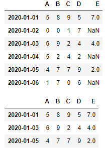
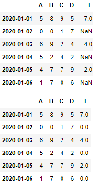
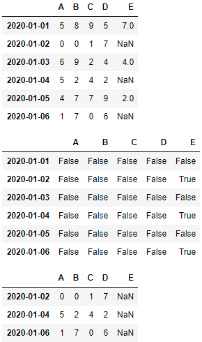
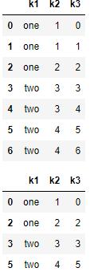
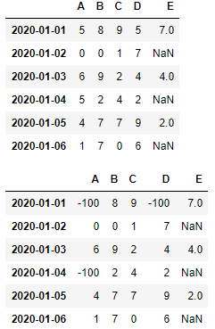
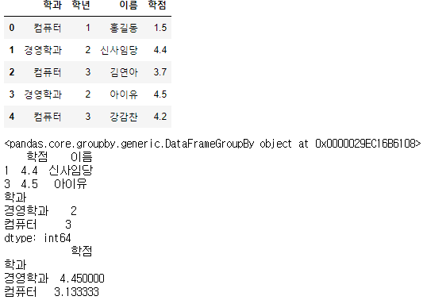
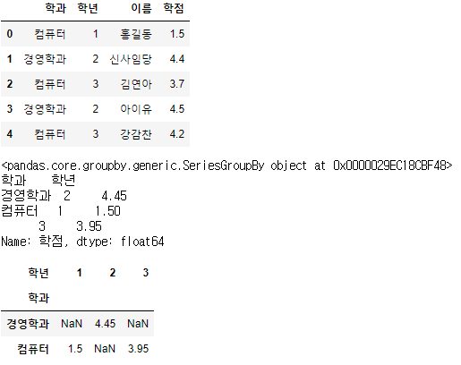
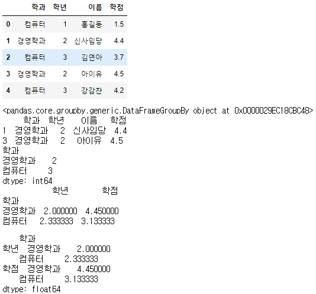
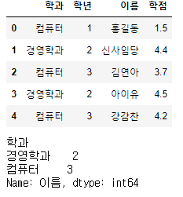
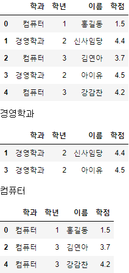

# DataFrame 조작

> * ```python
>   import numpy as np
>   import pandas as pd
>
>   # random값을 도출해서 DataFrame을 생성 => np.random.randint()
>   # 6행 4열짜리 DataFrame을 만들기!
>
>   np.random.seed(1)
>
>   df = pd.DataFrame(np.random.randint(0,10,(6,4)))
>
>   # df.index = pd.date_range('20200101', periods=6)
>   df.index = pd.date_range('20200101', '20200106')
>   df.columns = ['A', 'B', 'C', 'D']
>
>   # display(df)
>
>   df['E'] = [7, np.nan, 4, np.nan, 2, np.nan]
>   display(df)
>
>   # NaN은 데이터분석이나 머신러닝, 딥러닝 전에 반드시 처리해야하는 값!
>
>   new_df = df.dropna(how='any')  # how='any' NAN이 하나라도 해당 행에 존재하면 행을 삭제
>                         # how='all' 모든 컬럼의 값이 NaN인 경우 행을 삭제
>                         # inplace = False로 default 설정 
>   display(new_df)        
>   ```
>
>   * 출력 
>
>     
>
> * ```python
>   import numpy as np
>   import pandas as pd
>   
>    np.random.seed(1)
>   
>     df = pd.DataFrame(np.random.randint(0,10,(6,4)))
>   
>     # df.index = pd.date_range('20200101', periods=6)
>   
>     df.index = pd.date_range('20200101', '20200106')
>     df.columns = ['A', 'B', 'C', 'D']
>   
>     # display(df)
>   
>     df['E'] = [7, np.nan, 4, np.nan, 2, np.nan]
>     display(df)
>   
>     new_df = df.fillna(value=0)
>   
>     display(new_df)        
>   ```
>   
>   * 출력
>   
>     
>
>  
>
>   ```python
> import numpy as np
> import pandas as pd
> 
> np.random.seed(1)
> 
> df = pd.DataFrame(np.random.randint(0,10,(6,4)))
> 
> # df.index = pd.date_range('20200101', periods=6)
> df.index = pd.date_range('20200101', '20200106')
> df.columns = ['A', 'B', 'C', 'D']
> 
> # display(df)
> 
> df['E'] = [7, np.nan, 4, np.nan, 2, np.nan]
> display(df)
> 
> display(df.isnull())
> # 'E' column의 값이 NaN인 행들을 찾아 해당행의 모든 column값을 출력
> ## ????
> 
> display(df.loc[df.isnull()['E'],:])
>   ```
>
>   * 출력
>
>     
>     
>     

## 중복행 제어

> * ```python
>   import numpy as np
>   import pandas as pd
>
>   my_dict = {
>       'k1' : ['one'] * 3 + ['two'] * 4,
>       'k2' : [1,1,2,3,3,4,4]
>   }
>
>   df = pd.DataFrame(my_dict)
>   # display(df)
>
>   # print(df.duplicated())
>   # display(df.loc[df.duplicated(),:])  # 중복행을 알아내기
>   # display(df.drop_duplicates())   # 중복행을 제거
>
>   df['k3'] = np.arange(7)
>   display(df)
>   # display(df.drop_duplicates(['k1'])) # 특정 column을 기준으로 중복 제거
>   display(df.drop_duplicates(['k1','k2'])) # 특정 column을 기준으로 중복 제거
>   ```
>
>   * 출력
>
>     
>   
>     
>   
> * ```python
>   np.random.seed(1)
>
>   df = pd.DataFrame(np.random.randint(0,10,(6,4)))
>
>   # df.index = pd.date_range('20200101', periods=6)
>   df.index = pd.date_range('20200101', '20200106')
>   df.columns = ['A', 'B', 'C', 'D']
>
>   # display(df)
>
>   df['E'] = [7, np.nan, 4, np.nan, 2, np.nan]
>   display(df)
>
>   display(df.replace(5,-100))
>   ```
>
>   * 출력
>
>     


## Series, DataFrame의 Grouping

> * ```python
>   import numpy as np
>   import pandas as pd
>
>   my_dict = {
>       '학과' : ['컴퓨터','경영학과','컴퓨터','경영학과','컴퓨터'],
>       '학년' : [1, 2, 3, 2, 3],
>       '이름' : ['홍길동','신사임당','김연아','아이유','강감찬'],
>       '학점' : [1.5, 4.4, 3.7, 4.5, 4.2]
>   }
>
>   df = pd.DataFrame(my_dict)
>   display(df)
>
>   # 학과를 기준으로 grouping
>   score = df['학점'].groupby(df['학과'])
>   print(score)
>
>   # 그룹안에 데이터를 확인하고 싶은 경우에는 get_group()
>   print(score.get_group('경영학과'))
>
>   # 각 그룹안에 몇개의 데이터가 들어가 있나??
>   print(score.size())  # Series로 리턴됨!
>   print(score.mean())
>   ```
>
>   * 출력
>
>     
>   
>     
>   
> * ```python
>   import numpy as np
>   import pandas as pd
>
>   my_dict = {
>       '학과' : ['컴퓨터','경영학과','컴퓨터','경영학과','컴퓨터'],
>       '학년' : [1, 2, 3, 2, 3],
>       '이름' : ['홍길동','신사임당','김연아','아이유','강감찬'],
>       '학점' : [1.5, 4.4, 3.7, 4.5, 4.2]
>   }
>
>   df = pd.DataFrame(my_dict)
>   display(df)
>
>   # 학과 기준으로 grouping
>   score = df.groupby(df['학과'])
>   print(score)
>
>   # # 그룹안에 데이터를 확인하고 싶은 경우에는 get_group()
>   print(score.get_group('경영학과'))
>
>   # # 각 그룹안에 몇개의 데이터가 들어가 있나??
>   print(score.size())  # Series로 리턴됨!
>   print(score.mean())  # 결과가 Series로 나옴(멀티인덱스)
>   display(score.mean().unstack())  # 최하위 index를 column으로 변경
>   ```
>
>   * 출력
>
>     
>
> * ```python
>   import numpy as np
>   import pandas as pd
>   
>   my_dict = {
>       '학과' : ['컴퓨터','경영학과','컴퓨터','경영학과','컴퓨터'],
>       '학년' : [1, 2, 3, 2, 3],
>       '이름' : ['홍길동','신사임당','김연아','아이유','강감찬'],
>       '학점' : [1.5, 4.4, 3.7, 4.5, 4.2]
>   }
>   
>   df = pd.DataFrame(my_dict)
>   display(df)
>   
>   # 학과 기준으로 grouping
>   score = df.groupby(df['학과'])
>   print(score)
>   
>   # # 그룹안에 데이터를 확인하고 싶은 경우에는 get_group()
>   print(score.get_group('경영학과'))
>   
>   # # 각 그룹안에 몇개의 데이터가 들어가 있나요??
>   print(score.size())  # Series로 리턴되요!
>   print(score.mean())  # 결과가 Series로 나와요(멀티인덱스)
>   display(score.mean().unstack())  # 최하위 index를 column으로 변경
>   ```
>
>   * 출력
>
>     
>
> * ```python
>   import numpy as np
>   import pandas as pd
>
>   my_dict = {
>       '학과' : ['컴퓨터','경영학과','컴퓨터','경영학과','컴퓨터'],
>       '학년' : [1, 2, 3, 2, 3],
>       '이름' : ['홍길동','신사임당','김연아','아이유','강감찬'],
>       '학점' : [1.5, 4.4, 3.7, 4.5, 4.2]
>   }
>
>   df = pd.DataFrame(my_dict)
>   display(df)
>
>   # 1. 학과별 평균학점은?
>   # df['학점'].groupby(df['학과']).mean()
>   df.groupby(df['학과'])['학점'].mean()
>   # 2. 학과별 몇명이 존재하는가?
>   df.groupby(df['학과'])['이름'].count()
>   ```
>
>   * 출력
>
>     
>
> * ```python
>   import numpy as np
>   import pandas as pd
>
>   my_dict = {
>       '학과' : ['컴퓨터','경영학과','컴퓨터','경영학과','컴퓨터'],
>       '학년' : [1, 2, 3, 2, 3],
>       '이름' : ['홍길동','신사임당','김연아','아이유','강감찬'],
>       '학점' : [1.5, 4.4, 3.7, 4.5, 4.2]
>   }
>
>   df = pd.DataFrame(my_dict)
>   display(df)
>
>   for dept, group in df.groupby(df['학과']):
>       print(dept)
>       display(group)
>   ```
>
>   * 출력
>
>     
>     
>     


