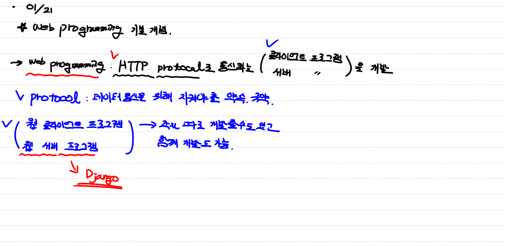

# Web programming 기본 개념

> * Web programming
>   * HTTP protocol로 통신하는 (웹 클라이언트 프로그름, 웹 서버 프로그램)을 개발
>     * protocol : 데이터 통신에 대한 서로 지켜야 할 규약
>       * HTTP => Web 전용 protocol
>       * FTP => File 전송 전용 protocol
>       * SMTP => E-mail 전송전용 Protocol
>       * 기타 등등........
>     * 웹 클라이언트 프로그램, 웹 서버 프로그램 - 각각 따로 개발 할 수도 있고 함께 개발 할 수도 있음.
>     * Django => 웹 서버 프로그램
> * Web program은 cs 구조로 되어있음.
>   * cs => (Client , Server)
>   * Client => 능동적으로 서비스 요청
>   * Server => 클라이언트 요청에 대해  서비스 제공
>
> 

## Web Client, Web Server

> * Web Client 
>   * web server에 접속하는 클라이언트 프로그램
>     * ex) => Browser (Chrome, IE, Safari, Firefox)
> * Web Server
>   * Web client의 요청을 받아 서비스를 제공하는 프로그램
>   * Web Server 는 일반적으로 따로 만들지 않고  만들어져 있는걸 사용
>     * Performance가 중요하기 때문에 우리가 만들지 않음
>     * Apache Web server, IIS, Oracle Webserver
> * 우리가 만들어야 하는 것은 Web Client와 Web Server에서 동작하는application
>   * Web Client application
>     * HTML, CSS, javascript
>   * Web Server application
>     * Django(Python), servlet(java)
> * Web client와 Web Server는 계속 연결되어 있지않음

## port

> * Ip 주소와 Mac주소 port 번호 알고 있으면 특정 컴퓨터 찾아갈 수있음. 
>   * HTTP://192.168.0.34:4000
>     * HTTP => Protocol
>     * 192.168.0.34 => IP address
>     * 4000 => port
> * 0 ~ 65535 사이의 하나의 숫자 (포트번호)
>   * 하나의 Process (프로그램)
> * 0~ 1024 : reserved (예약)
> * 1025~65535 : 사용자가 이용
> * port 번호는 프로그램을 지칭
> * 우리 컴퓨터에서 동작하는 Program
>   * 메모장
>   * Zoom
>   * Chrome
>   * 탐색기 
>   * 기타 등등.......
> * protocol, IP, Port => URL

## address

> * Ip address => 특정 컴퓨터의 고유주소
>   * Network에 연결되어 부여되는 논리적 주소
>   * 4자리
>     * ex) 192.168.34.2
> * MAC address
>   * 물리적인 주소
>   * 6자리 
>     * ex) 34.37.128.34.2.76

## HTTP protocol

> * Hypertext transfer protocol
> * 웹 서버와 웹클라이언트가 서로 데이터를 주고 받기 위해 사용하는 통신규약
>   * TCP/IP protocol stack 위에서 통신하는 protocol 
>     * IP address 기반통신
> * HTTP => Text 뿐아니라 (이미지, 동영상, PDF....) => 여러종류의 Data를 주고 받을 수 있음. 

## HTTP protocol의 특징

> * Web client와 Web Server는 계속 연결되어 있지않음
>   * Server는 하나고 client는 다수 이기 떄문에
>   * 여러 client가 하나의 Sever에 계속 연결 되어 있으면 Server에 부하가 감
>     * 보통 한번의 request가 가고 response가 오면 연결이 끊어짐
>       * Server가 Client를 구별할 수 없음
> * Stateless protocol
>   * Stateless => 서버가 상태를 알 수 없음.

## Request 방식

### GET

> * 모든 CRUD 작업 가능
> * 내가 전달할 데이터를 Query String 형식으로 URL뒤에 붙여서 보냄.
>   * 일일 박스 office 순위 => open API
> * 장점 
>   * 사용하기 쉬움.
> * 단점
>   * 보안성이 없다.
>   * URL 길이 제한있음

### post

> * request message body 부분에 데이터를 포함 전송
> * 장점
>   * 보안성이있음.
>   *  보내려는 데이터의 길이 제한이 없음.

