# Web Programming

## jQuery 

> * ```html
>   <body>
>       <div>
>           <ul>
>               <li id = 'apple'>사과</li>
>               <li id = 'pineapple'>파인애플</li>
>               <li class = 'myList'>참외</li>
>           </ul>
>           <!--사용자 입력 양식 : 사용자로부터 데이터를 입력받아서 서버로 전송-->
>           <form action="#" method="post">
>               <input type = "text" id ="uID" size ="20">
>           </form>
>           <ol>
>               <li class = "myList">고양이</li>
>               <li class = "myList">호랑이</li>
>               <li class = "myList">강아지</li>
>           </ol>
>           <input type = button value = "클릭" onclick = "my_func()">
>       </div>
>   </body>
>   ```
>
>   * 출력
>
>     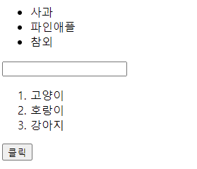
>
> * ```javascript
>   console.log($("#apple").text()) //text() 인자 없으면 내용출력
>   ```
>
>   * 출력
>
>     
>
> * ```javascript
>   $("#apple").text("돼지") // text() 인자 있으면 내용이 인자로 변경
>   ```
>
>   * 출력
>
>     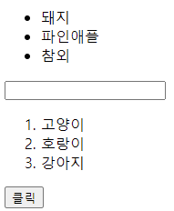
>
> * ```javascript
>   console.log($("ul > .myList").text()) 
>   // 구조 선택자 > 클래스 선택자 ul의 자식인 클래스 출력
>   ```
>   * 출력
>
>     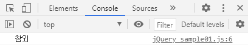
>
> * ```javascript
>   console.log($("#uID").val()) 
>   //입력상자안의 값을 가져올때는 text()가 아니라 val()  ##헷갈리지 않게 조심!
>   ```
>
>   * 출력
>
>     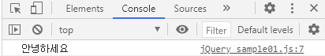
>
> * ```javascript
>   console.log($('input[type = text]').attr('id')) 
>   // input의 타입이 text인것의 id를 출력
>   ```
>
>   * 출력
>
>     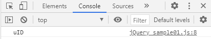
>
> * ```javascript
>   console.log($('input[type = text]').attr('size',1))
>   // attr()안의 인자를 하나 더주면 다른값으로 변경가능
>   ```
>
>   * 출력 
>
>     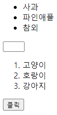
>
> * ```javascript
>   console.log($("ol > li:first").text()) // ol의 자식으로 있는 li중에 첫번째
>   ```
>
>   * 출력
>
>     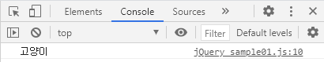
>
> * ```javascript
>   console.log($("ol > li:last").text()) // ol의 자식으로 있는 li중에 마지막
>   ```
>
>   * 출력
>
>     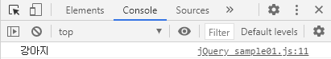
>
> * ```javascript
>   console.log($("ol > li:first + li").text()) 
>   //ol의 자식으로 있는 li중에 첫번째의 바로 다음에 나오는 형제 출력
>   ```
>
>   * 출력
>
>     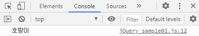
>
> * ```javascript
>   console.log($("ol > li:eq(1)").text())
>   //ol의 자식으로 있는 li중에 첫번째의 바로 다음에 나오는 형제 출력
>   ```
>
>   * 출력
>
>     
>
> * 이름이 없는 함수 => 묵시적 함수 => lambda 함수
>
>   * 결국 함수를 독립적으로 선하지못하고 변수같은곳에 저장해서 사용
>
>   * 함수를 하나의 값으로 인식 => first class
>
>   * 함수가 하나의 값으로 사용되기 때문에 함수를 다른 함수의 인자로 활용이 가능
>
>   * ```javascript
>     let kaka = function() {}
>     ```
>
> * ```javascript
>   $("ol > li").each(function (idx,item) {
>      console.log((idx+1)+ "번째 " + $(item).text()+ '입니다')})
>   ```
>
>   * 출력 
>
>     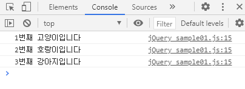


> * ```html
>       <style>
>           /*div{*/
>           /*    width : 100px;*/
>           /*    height : 50px;*/
>           /*    background-color: yellow;*/
>           /*}*/
>   
>           .mystyle{
>               width : 100px;
>               height : 50px;
>               background-color: yellow;
>           }
>       </style>
>   
>   </head>
>   <body>
>       <div>이것은 소리없는 아우성</div>
>       <div class = "mystyle">
>           <ol>
>               <li>홍길동</li>
>               <li>김길동</li>
>           </ol>
>       </div>
>       <ul>
>           <li>김연아</li>
>           <li>이순신</li>
>           <li>강감찬</li>
>       </ul>
>   
>       <input type ="button" value="클릭되나?" disabled = "disabled">
>       <input type = button value="클릭" onclick="my_func()">
>       <input type = button value="스타일 제거" onclick="remove_func()">
>   </body>
>   ```
>
>   * 출력
>
>     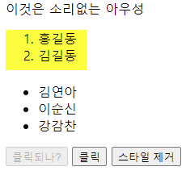
>
> * ```javascript
>   $("div").css("color" , "red")
>   $("div").css("background-color" , "yellow")
>   // 이방식은 부하가 많이 걸려 효율이 좋지 않음
>   ```
>
>   * 출력
>
>     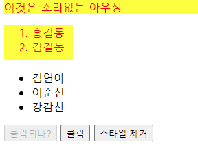
>
> * ```javascript
>   $("div").addClass("mstyle")
>   // class를 추가하여 바꾸는 방식 위방식보다 효과적
>   ```
>
> * ```javascript
>   $("input[type=button]:first").removeAttr("disabled")
>   //첫번째 버튼의 disabled기능을 제거
>   ```
>
>   * 출력
>
>     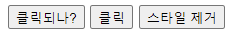
>
> * ```javascript
>   $("div.mystyle").empty() // 자신은 삭제하지말고 자신의 후손을 삭제
>   ```
>
>   * 출력
>
>     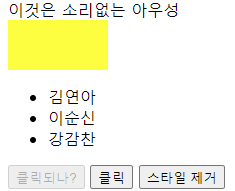
>
> * ```javascript
>   $("div.mystyle").remove()
>   // 자신과 함께 자신의 후손까지 삭제
>   ```
>
>   * 출력
>
>     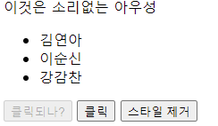
>
> * 없는 Element를 만들기
>
>   * ```javascript
>     let my_div = $("<div></div>").text("소리없는 아우성")   // => <div>소리없는 아우성</div>
>     // 위와 같은 방법으로 없는 element를 새롭게 생성가능
>     let my_img = $("").attr("src","img/python-rotate.jpg")  
>     //
>     let my_li = $("<li></li>").text("아이유")    //<li>아이유</li>
>     ```
>
> * 새로운 element를 만들고 원하는 위치에 가져다 붙여야함
>
> * 4종류의 함수를 이용해서 element를 원하는 위치에 가져다 붙일수 있음!
>
>   * append() : 자식으로 붙이고 맨 마지막 자식으로 붙임
>
>   * ```javascript
>     $("ul").append(my_li)
>     ```
>
>     * 출력
>
>       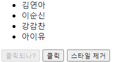
>
>   * prepend() : 자식으로 붙이고 맨 처음 자식으로 붙임
>
>   * ```javascript
>     $("ul").prepend(my_li)
>     ```
>
>     * 출력
>
>       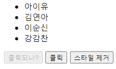
>
>   * after(): 형제로 붙이고 바로 다음 형제로 붙임
>
>   * ```javascript
>     $("ul > li:eq(1)").after(my_li)
>     ```
>
>     * 출력
>
>       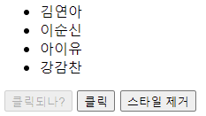
>
>   * before() : 형제로 붙이고 바로 이전 형제로 붙임
>
>   * ```javascript
>     $("ul > li:last").before(my_li)
>     ```
>
>     * 출력
>
>       
>
>     

