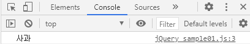

# Web Programming

## jQuery 

> * ```html
>   <body>
>       <div>
>           <ul>
>               <li id = 'apple'>사과</li>
>               <li id = 'pineapple'>파인애플</li>
>               <li class = 'myList'>참외</li>
>           </ul>
>           <!--사용자 입력 양식 : 사용자로부터 데이터를 입력받아서 서버로 전송-->
>           <form action="#" method="post">
>               <input type = "text" id ="uID" size ="20">
>           </form>
>           <ol>
>               <li class = "myList">고양이</li>
>               <li class = "myList">호랑이</li>
>               <li class = "myList">강아지</li>
>           </ol>
>           <input type = button value = "클릭" onclick = "my_func()">
>       </div>
>   </body>
>   ```
>
> * ```javascript
>   console.log($("#apple").text()) //text() 인자 없으면 내용출력
>   ```
>
>   * 출력
>
>     

