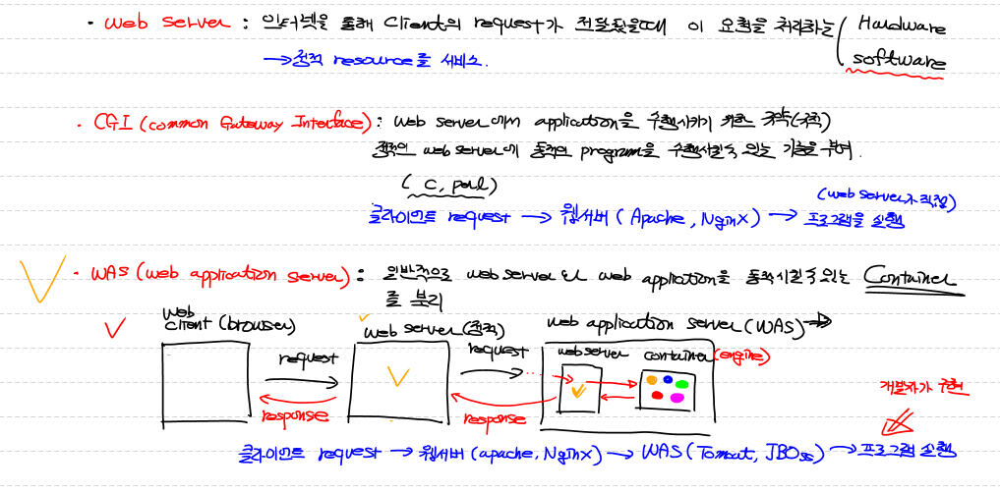
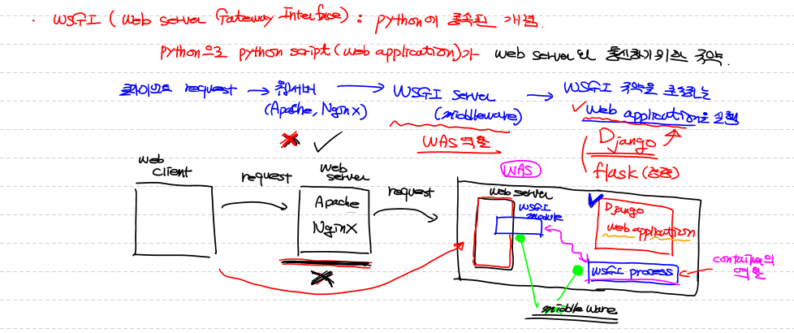
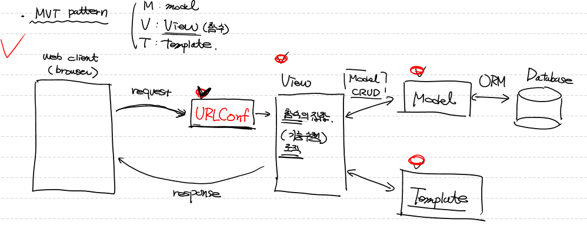
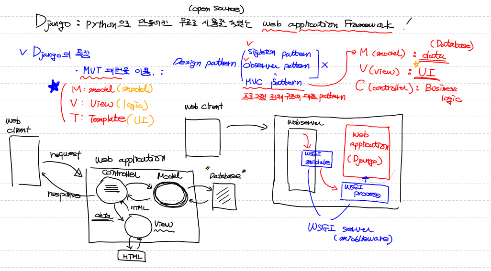
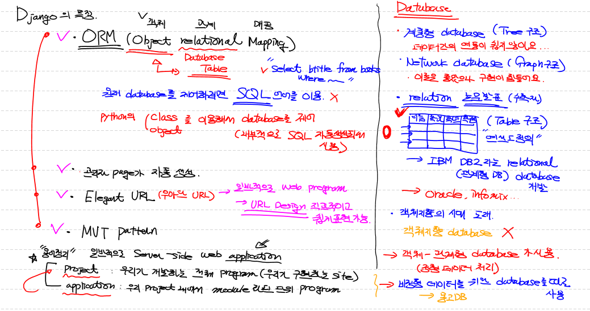
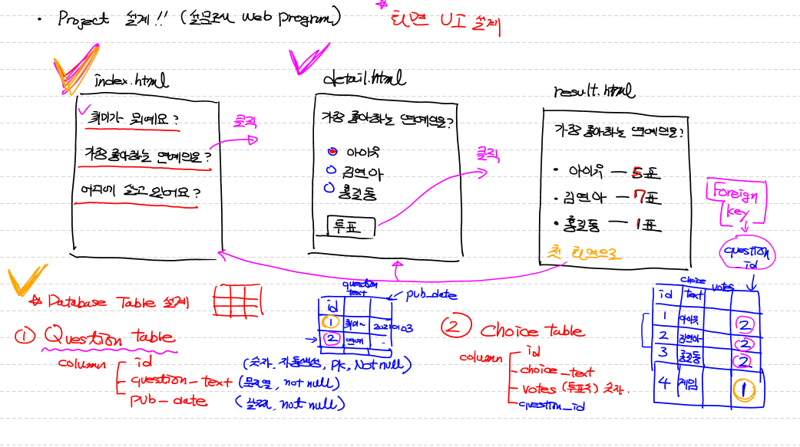
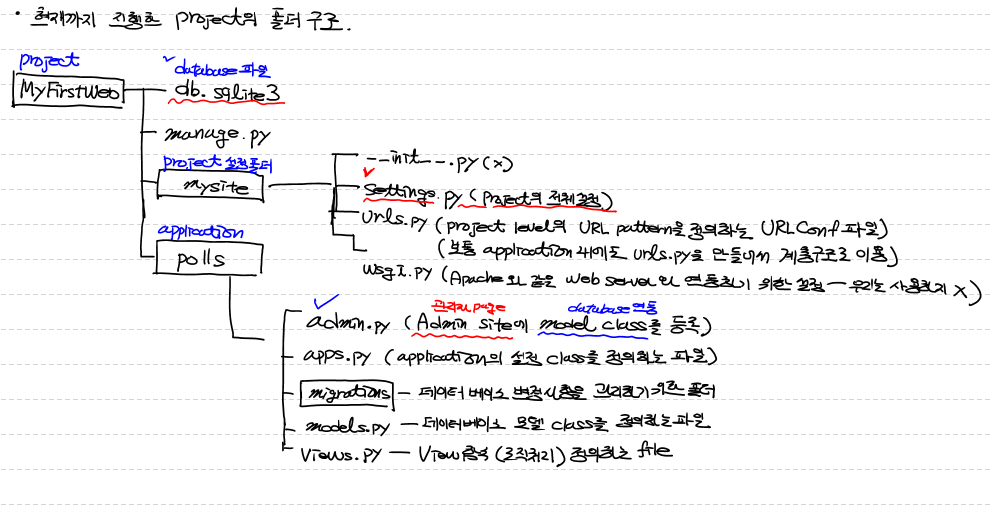

## Web Server

> * 인터넷을 통해 client의 request가 전달 되었을때 이 요청을 처리하는 (Hardware, Software)
> * 정적 resource를 서비스하는데 특화되어 있는 프로그램

## CGI 

> * Common Gateway Interface
> * Web Server에서 application을 수행시키기 위한 규약
> * 정적인 Web Server에 동적인 program을 수행시킬수 있는 기능을 부여
> * 클라이언트 request  => 웹서버 (Apache,Nginx) => 프로그램 실행(Web server가 직접)

## WAS

> * 일반적으로 Web server와 Web application을  동작시킬수 있는 container를 분리
> * 

## WSGI 

> * Web server Gateway Interface
> * Python에 종속된 개념
> * Python으로 Python script(web application)가 Web server와 통신하기 위한규약
> * 클라이언트 request => 웹서버(Apache,Nginx) => WSGI server(middleware) : WAS역할 => WSGI규약을 준수하는 Web application을 실행 (Django,Flask(경량))
> * 

## Django

> * Python으로 만들어진 무료로 사용할 수 있는 Web application Framework
> * 

### Django의 특징

> * MVT 패턴을 이용 
>   *  Design pattern
>     * single ton pattern
>     * observer pattern
>     * MVC pattern  
>   * MVC pattern
>     * (Model View controller) => 프로그램 전체 구조에 대한 pattern
>     * M(Model) : Data
>     * V(View) : UI
>     * C(Controller) : Business logic
>   
> * ORM
>   
>   * 객체 관계 매핑 (Object Relational Mapping)
>   
> * 관리자 page가 자동 생성
>
> * 
>
>   
>
> * 

### 용어정리

> * 일반적으로 Server Side Web application
> * project : 우리가 개발하는 전체 Program (우리가 구현하는 Site)
> * application : 우리 project 내에서 module단위 program

## Project 설계 (설문조사 WebProgram)

> * 

## 현재까지 진행한 Project의 폴더 구조

> * MyFirstWeb  -  Project
>
>   * db.sqlite3 - database파일
>   * manage.py
>   * mysite - Project 설정폴더
>     * __init__.py(x)
>     * setting.py - Project의 전체 설정
>     * urls.py - project level의 URL pattern을 정의하는 URL conf파일
>     *  wsgi.py - Apache와 같은 WebServer와 연동하기 위한 설정 (우리는 사용하지 않음)
>   * polls - application
>     * admin.py - Admin site(관리자 page)에 model class(database 연동)를 등록
>     * apps.py - application의 설정 class를 정의하는 파일
>     * migrations - 데이터 베이스 변경사항을 관리하기 위한 폴더
>     * models.py - 데이터 베이스로 모델 class를 정의하는 파일
>     * views.py - View함수 (로직처리) 정의하는 파일
>
> * 
>
>   